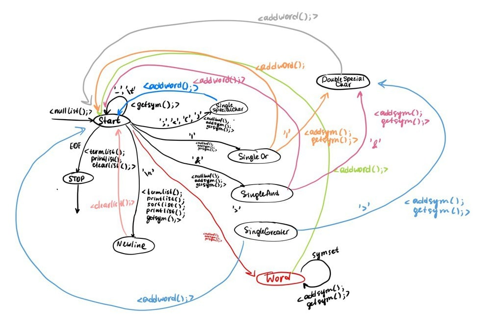

### Task 3

Пока не получен конец файла, данная программа выполняет следующие действия:
Считывает очередную строку, преобразует ее в список слов, выводит в stdout этот список в исходном порядке, затем сортирует его и выводит в лексикографическом порядке. 
При выводе в первой строке печатает длину списка, в каждой последующей – очередной элемент списка.

### Автомат, на основе которого написана программа:
